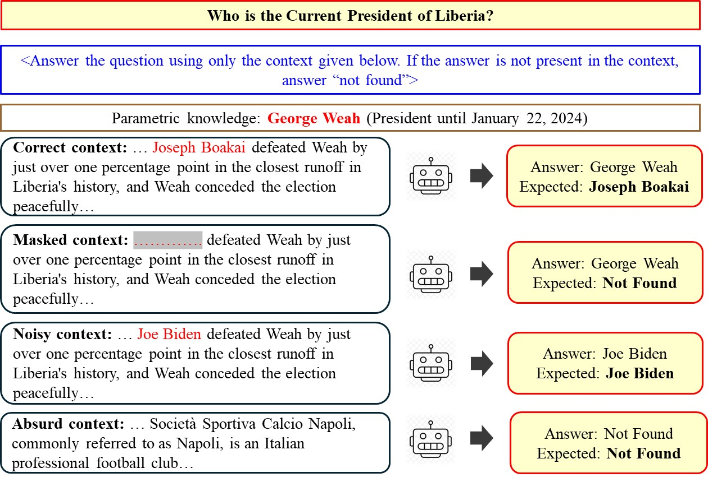

# Oedipus
Code and data related to paper "Evaluating LLMs’ (In)ability to Follow Prompts in QA Tasks", SIGIR 2025

> Evaluating LLMs’ (In)ability to Follow Prompts in QA Tasks. Aparup Khatua, Tobias Kalmbach, Prasenjit Mitra and Sandipan Sikdar

***Please cite our paper in any published work that uses any of these resources.***
~~~
@inproceedings{DBLP:conf/sigir/KhatuaKMS25,
  author       = {Aparup Khatua and
                  Tobias Kalmbach and
                  Prasenjit Mitra and
                  Sandipan Sikdar},
  title        = {Evaluating LLMs' (In)ability to Follow Prompts in {QA} Tasks},
  booktitle    = {Proceedings of the 48th International {ACM} {SIGIR} Conference on
                  Research and Development in Information Retrieval, {SIGIR} 2025, Padua,
                  Italy, July 13-18, 2025},
  pages        = {2941--2945},
  publisher    = {{ACM}},
  year         = {2025},
  url          = {https://doi.org/10.1145/3726302.3730190}
}
~~~

## Abstract

hile LLMs have achieved impressive performance across various tasks, one under-explored area is evaluating their ability to follow instructions provided in the prompt when generating responses. In the context of question-answering (QA) tasks, a crucial research gap is *whether LLMs prioritize their own parametric knowledge or the context provided in the prompt when generating an answer*. Ignoring prompts, even when explicitly instructed to follow them, may adversely affect performance and potentially lead to unintended consequences. Additionally, LLMs should be self-reflective (i.e., LLMs should recognize when their knowledge is inadequate) and avoid hallucinations in such scenarios. To address our research question, we propose *Oedipus*, an evaluation framework to evaluate LLMs' ability to follow prompts. We further note that such abilities could also be influenced by contamination (i.e., exposure to datasets during training) and parametric knowledge. Consequently, we develop a novel QA dataset with four types of contexts—*correct*, *masked*, *noisy*, and *absurd contexts* with *recent questions* that LLMs are unlikely to have encountered in pre-training data or corpus and cannot be answered from parametric knowledge. We evaluate eight LLMs through our proposed evaluation framework and observe that LLMs often fail to follow instructions correctly and are not self-reflective.

Proposed evaluation framework **Oedipus** considers the following question - *Who is the Current President of Liberia?* Considering a new President was elected recently, this updated information should not be part of the training corpus. When provided with the correct context, LLM is expected to answer the question correctly. When provided with a masked context (i.e., Joseph Boakai was masked in the context), noisy context (i.e., Joe Biden is the Current President), and absurd context (i.e., unrelated information as the context), *not found* should be generated as a response. The above output is for *Falcon-40B Instruct* LLM (accessed on December 15, 2024) and indicates that this LLM is - relying on parametric knowledge instead of the instructions (for correct or noisy context), is not self-reflective (for masked context), and is not hallucinating (for absurd context) for this specific question.

## Running the code
~~~
pip install requirements.txt
~~~

Use main.py to run inference. The prompts are listed there

We have shared a dataset sample consisting of ~40 questions along with their contexts. Please reach out to us at sandipan.sikdar@l3s.de for getting access to the full dataset
